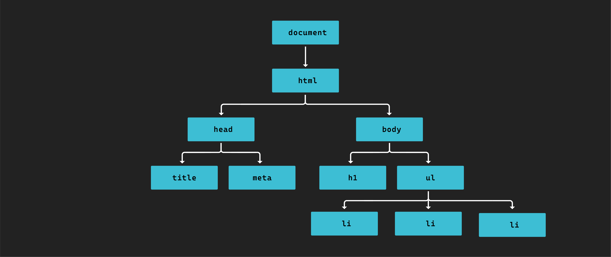

<h1>
  Intro to the DOM
  Concepts
</h1>

**Learning objective:** By the end of this lesson, students will have a basic understanding of the Document Object Model (DOM).

## What is the DOM?

The [DOM (Document Object Model)](https://developer.mozilla.org/en-US/docs/Web/API/Document_Object_Model/Introduction) is a data representation of a web page loaded in the browser.

The DOM is a tree-like data structure with the top (root) being the `document` object. It mirrors the tree-like structure of the HTML for a given document. Each element in the DOM is referred to as a node.

JavaScript uses the DOM to access an HTML document and its elements. The DOM has an *application programming interface* or [*API*](https://en.wikipedia.org/wiki/Application_programming_interface) that enables developers to make the UI dynamic by using JavaScript.

> 📚 An API, or Application Programming Interface, is a set of predefined rules or methods that enables communication and data exchange between software components, applications, or systems.
>
> More specifically, the DOM API, is a set of methods and properties provided by web browsers that allow us to interact with and manipulate the structure, content, and attributes of HTML using JavaScript.

## Why do we use the DOM?

By itself, HTML is fairly static. But by using the DOM we can do things like:

- Read and change content.
- Change how elements are styled.
- Modify element attributes.
- Create or remove elements.
- Respond to events.

If we want to modify existing elements or display new ones using JavaScript, we rely on the DOM. We can also make web pages dynamic and respond to user actions by manipulating the DOM using JavaScript.
